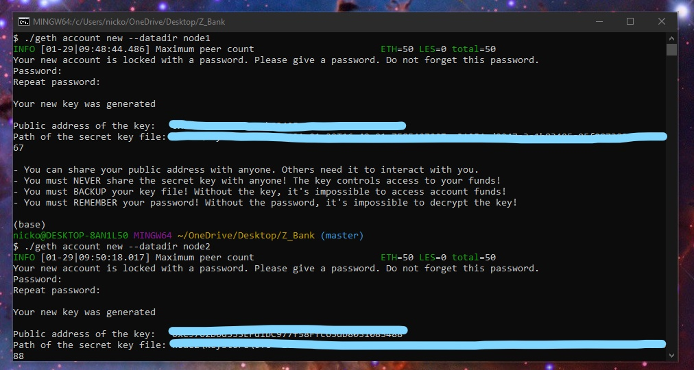
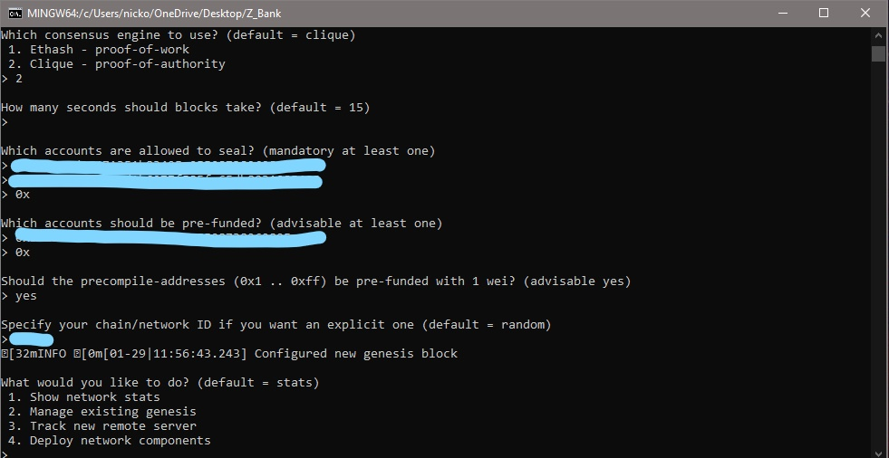
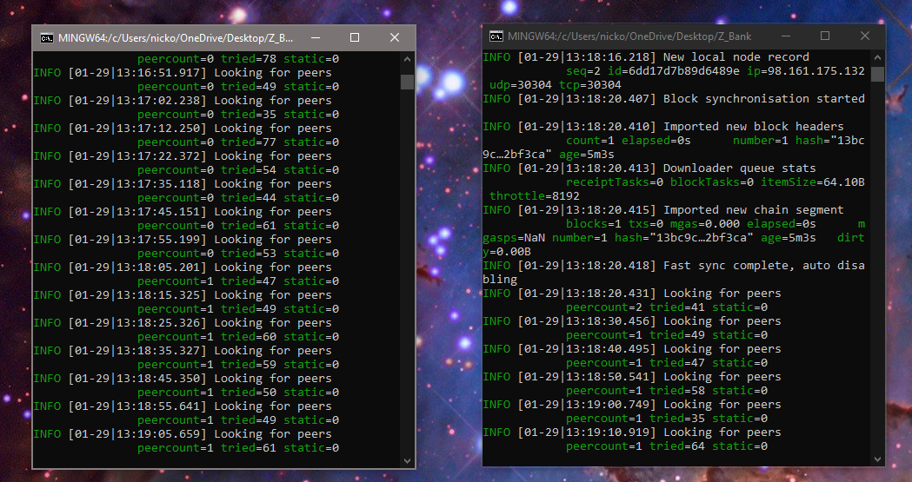
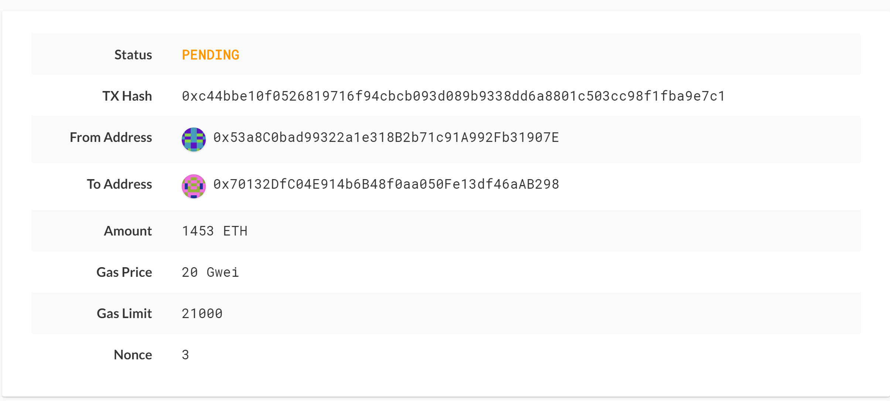

# ZBank_Blockchain_Test

---

## Background

Project is to set up a private testnet that you and your team of developers can use to explore potentials for blockchain at the ZBank.

In order to set up the tesnet, you will need to use the following skills:

* Puppeth, to generate block.
* Geth, a command-line tool, to create keys , initialize nodes and connect the nodes together. 
* The Clique Proof of Authority 
---

### Build Node

One of the first things you would want to do is create your POA is to create your 2 node's, by using the the command line the terminal 

(./geth --datadir node1 accounnt new).
Make sure you save your address, secret key , and private key. 

You would also want to init both node's after you create your network with this command line  ( ./geth --datadir node1 init networkname.json )

---

### Genesis Block Creation
 To create a new genesis block ( puppeth ) is needed. command line ( ./puppeth ).
 Follow the prompts to complete the genesis; you should pre-fund the pre-compiled account also. 
 Export genesis configuration.

---
### Node Activated 

---
### Transaction 

In conclusion  POA had some minor issues trying to complete transactions, but the block chain was build successfully. 

---
